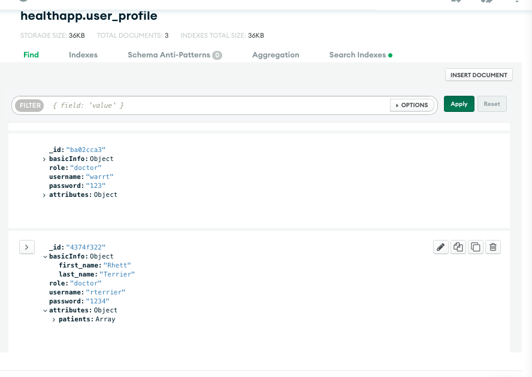
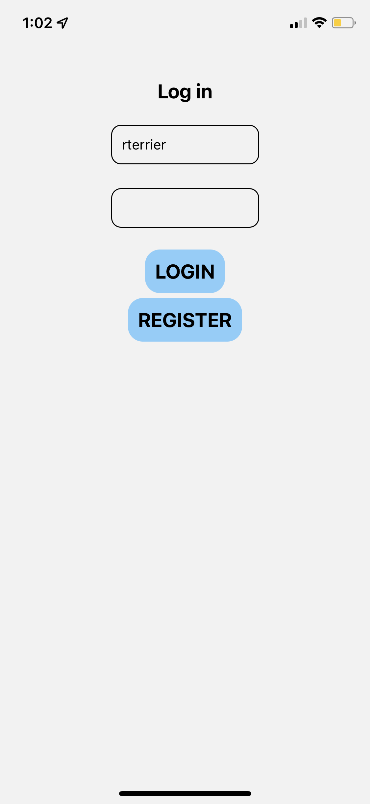
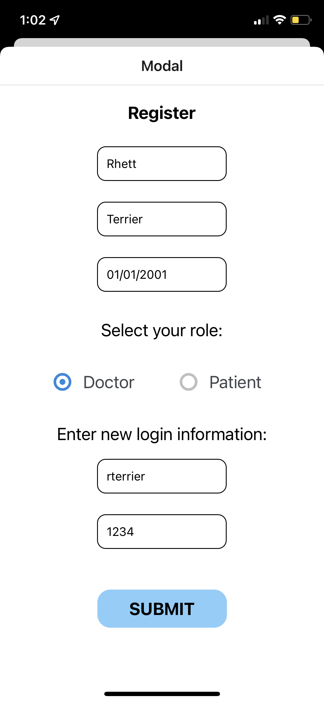
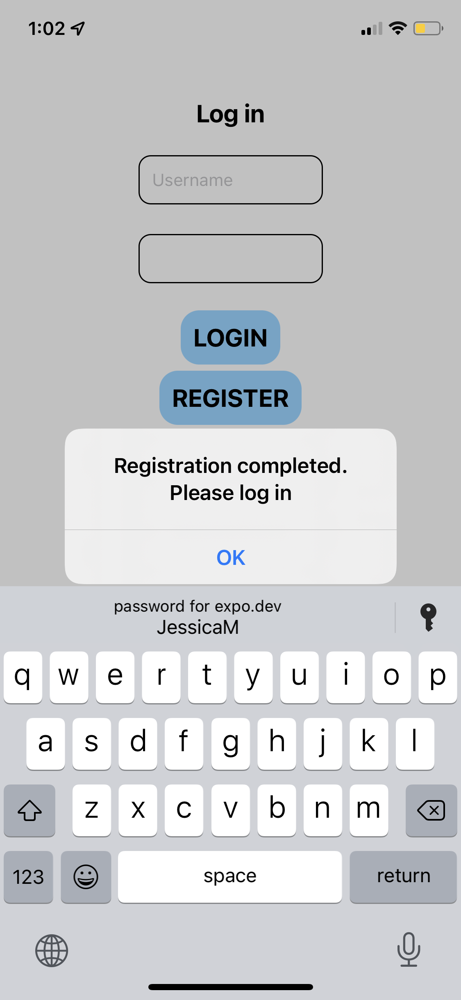
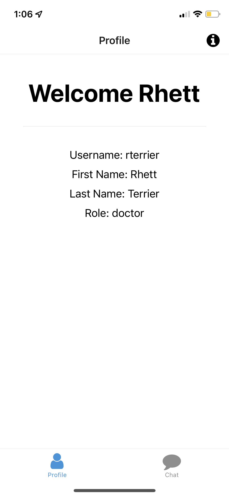

# EC530 Health App
EC530 Final Project

# Description
Health application that monitor patients remotely. There are different types of users in 
the app: patients, medical professionals, administrators. 

# Project Plan
- health app plan is at this [link](https://docs.google.com/document/d/1CUC7uYHHLEFkz3GPRT_QOUC417daMQfkl-G9ej55-Hw/edit#)

# Modules

## User Module

### REST API (for user module)

- The resf api for user module is deployed to [google cloud](https://health-app-2022.ue.r.appspot.com/users)
  
### `/users`

- GET function:
	- The GET method requests user profile data from MongoDB
    	- Input: username
        - Output: user profile in JSON format

	- Error handling: If the username is not found, the following error is returned:
	`{message: 'User not found'}`

- POST function:
	- The POST method creates new user profile to MongoDB based on provided information, including
	first name, last name, username, etc.

- Data structure

Doctor data field:
```python
"basicInfo": {
             _id: string,
             basicInfo: {
             	first_name: string,
             	last_name: string,
             },
             role: string,
             username: string,
             password: string,
             attributes: {
             	patients: list,
             },
         },
```

Patient data field:
```python
"basicInfo": {
             _id: string,
             basicInfo: {
             	first_name: string,
             	last_name: string,
             },
             role: string,
             username: string,
             password: string,
             attributes: {
             	DOB: string,
             	assigned_doctor: string
             },
         },
```

- Error Message
If one of the variables above is missing, the following error message shows:
```python 
{
	"message":
    {
	    "f_name": "Missing required parameter in the post body"
	}
}
```

## Database
- MongoDB is used for the database to store user information, it is connected to google cloud and access, controlled and queried by 'restUserAPI.py'.

- Example 
  
The below image shows the data collections of user profiles
>

## User Interface
Login
>

Registration 
>

Successful Registration
>

User Profile
>
